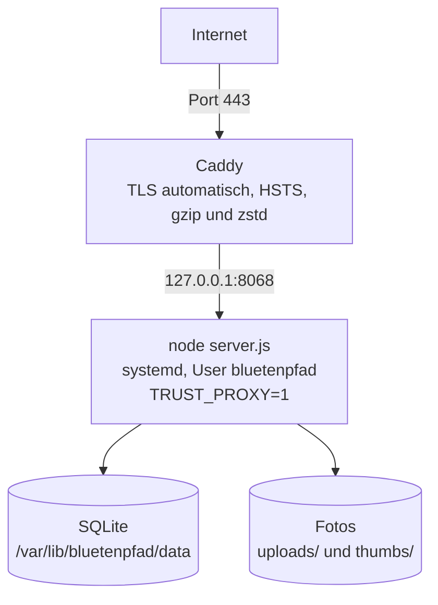
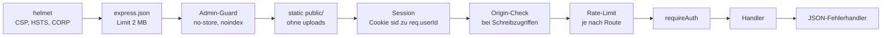
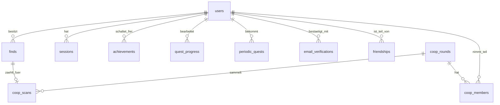
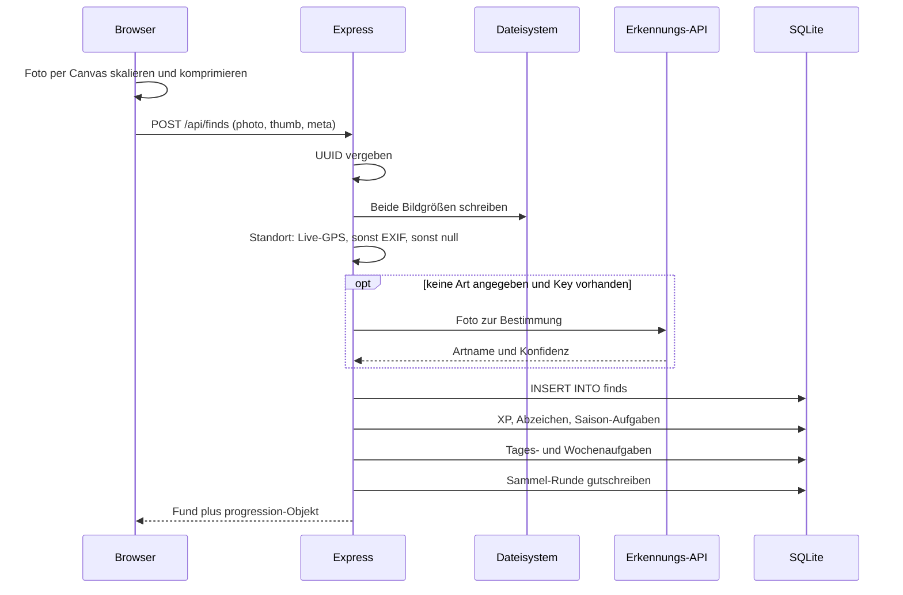

<p align="center">
  
</p>

<h1 align="center">Blütenpfad</h1>

<p align="center">
  Eine Natur-Sammel-PWA im Stil von Animal Crossing: Pflanze fotografieren,<br>
  Standort dazu, Steckbrief lesen, Sammlung füllen, rausgehen.
</p>

<p align="center">
  <a href="https://bluetenpfad.de">bluetenpfad.de</a> ·
  = 18"> ·
   ·
   ·
  
</p>

---

## Worum es geht

Ein Hobby-Projekt für Mitteleuropa, das trotz kleiner Codebasis alles enthält, was eine
echte Anwendung braucht: Authentifizierung, Foto-Upload mit EXIF-Auswertung, angebundene
Erkennungs-APIs, ein Fortschrittssystem, Freundeslisten, einen Mehrspieler-Modus, ein
Admin-Panel, DSGVO-Endpunkte und ein gehärtetes Deployment.

Interessanter als der Funktionsumfang ist vermutlich, was fehlt: kein React, kein
Bundler, kein ORM, kein Docker, kein Redis, kein Worker-Prozess. Ein Node-Prozess, eine
SQLite-Datei, ein Verzeichnis mit statischen Dateien. Die Gründe dafür stehen unter
[Leitgedanken](#leitgedanken).

Dieses Repository ist eine öffentliche Fassung des Codes. Serveradressen und
Impressumsangaben sind durch Platzhalter ersetzt, Secrets liegen ausschließlich in der
Umgebung.

## Inhalt

- [Leitgedanken](#leitgedanken)
- [Tech-Stack](#tech-stack)
- [Repo-Struktur](#repo-struktur)
- [Architektur](#architektur)
- [Datenmodell](#datenmodell)
- [API-Referenz](#api-referenz)
- [Ablauf: wie ein Fund entsteht](#ablauf-wie-ein-fund-entsteht)
- [Auth und Sicherheit](#auth-und-sicherheit)
- [Fortschrittssystem](#fortschrittssystem)
- [Der Arten-Katalog](#der-arten-katalog)
- [Sammel-Runden](#sammel-runden)
- [Lokal starten](#lokal-starten)
- [Konfiguration](#konfiguration)
- [Deployment](#deployment)
- [Bekannte Grenzen](#bekannte-grenzen)

---

## Leitgedanken

### Ein Prozess, eine Datei, kein Build

Das Frontend liegt als statisches Verzeichnis und wird vom selben Express-Server
ausgeliefert, der auch die JSON-API bedient. Ein Deployment besteht aus Dateien kopieren
und Dienst neu starten. Es gibt kein `npm run build`, kein Artefakt und keine Sourcemaps.
Der Code, der im Browser läuft, ist derselbe, der im Repository steht. Das macht
Fehlersuche auf dem iPhone im Feld erträglich.

### SQLite reicht, und better-sqlite3 ist synchron

Bei ein paar tausend Funden und einstelligen Nutzerzahlen ist ein Netzwerk-Hop zu einer
Datenbank vor allem Latenz. `better-sqlite3` arbeitet synchron, was in Node zunächst
falsch aussieht, hier aber der eigentliche Punkt ist: keine Promise-Ketten, keine
verschachtelten Transaktionen, keine Wettläufe zwischen dem Insert eines Fundes und der
XP-Vergabe darauf. Der WAL-Modus sorgt dafür, dass Leser Schreiber nicht blockieren.

### Migrationen sind idempotent und laufen beim Start

Es gibt kein Migrations-Framework und keine Versionstabelle. Stattdessen prüft der Server
beim Hochfahren über `PRAGMA table_info` selbst, ob eine Spalte fehlt, und legt sie bei
Bedarf an. Jede Migration ist so geschrieben, dass sie beliebig oft laufen darf. Ein
Rollback ist damit das Zurückkopieren der Datenbankdatei.

### Fehlende Konfiguration schaltet Funktionen ab, statt sie zu zerbrechen

Ohne `PLANTNET_API_KEY` läuft die App, nur die automatische Bestimmung ist aus. Ohne
`ADMIN_USER` und `ADMIN_PASSWORD` existiert das Admin-Panel gar nicht. Ohne
Mail-Konfiguration wird der Bestätigungslink in die Konsole geschrieben, statt dass die
Registrierung fehlschlägt. Secrets stehen nie im Repository, sondern kommen auf dem
Server aus `/etc/bluetenpfad.env`.

---

## Tech-Stack

| Bereich | Wahl | Begründung |
|---|---|---|
| Runtime | Node.js ab Version 18 | wegen `fetch`, sonst reichen die Built-ins weit |
| HTTP | Express 4 | klein, bekannt, wenig Overhead |
| Datenbank | SQLite über `better-sqlite3` (WAL) | synchron, keine Netzwerklatenz, eine Datei zum Sichern |
| Upload | `multer` mit MemoryStorage | der Buffer geht direkt an EXIF-Parser und Erkennungs-API, ohne Zwischendatei |
| EXIF und GPS | `exifr` | liest Koordinaten aus dem Foto, wenn Live-GPS fehlt |
| Passwörter | `crypto.scrypt` aus Node | keine native Abhängigkeit wie bcrypt oder argon2 |
| Security-Header | `helmet` mit strikter CSP | Details unter [Auth und Sicherheit](#auth-und-sicherheit) |
| Rate-Limiting | `express-rate-limit` | sechs getrennte Limiter |
| E-Mail | `lib/mailer.js`, selbst geschrieben | rund 330 Zeilen auf `net`, `tls` und `https`, ohne Abhängigkeit |
| Frontend | Vanilla JS | siehe erster Leitgedanke |
| Karte | Leaflet und markercluster, lokal abgelegt | liegt in `public/vendor/`, kein CDN, dadurch strengere CSP möglich |
| Kartendaten | CartoDB Voyager und OSM, GBIF-Density-Tiles | Verbreitungskarten im Steckbrief |
| PWA | Manifest und Service Worker | offlinefähige App-Shell |

Acht Laufzeit-Abhängigkeiten insgesamt. Neue kommen nur mit klarer Begründung dazu.

---

## Repo-Struktur

```
.
├── server.js                 Das gesamte Backend, rund 2.250 Zeilen
├── lib/
│   └── mailer.js             Mailer ohne Abhängigkeiten: Brevo-HTTP-API oder SMTP
├── public/                   Wird statisch ausgeliefert, kein Build
│   ├── index.html            App-Shell mit vier Tabs
│   ├── app.js                Frontend-Logik, rund 2.000 Zeilen
│   ├── style.css             Cozy-Cream-Design
│   ├── species.js            Arten-Katalog mit 265 Einträgen
│   ├── sw.js                 Service Worker
│   ├── admin.{html,css,js}   Separates Admin-Panel
│   ├── impressum.html        Rechtstexte, hier anonymisiert
│   ├── datenschutz.html
│   ├── naturschutz.html      Hinweise zum Sammeln
│   └── vendor/               Leaflet, markercluster, exifr
├── deploy/
│   ├── bluetenpfad.service   systemd-Unit inklusive Härtung
│   └── Caddyfile             Reverse-Proxy, TLS, Security-Header
├── scripts/
│   ├── provision-vps.sh      Server von null aufsetzen
│   ├── deploy-netcup.sh      rsync und Neustart
│   ├── backup.sh             Datenbank und Fotos sichern
│   └── migrate-from-pi.sh    Daten von der LAN-Instanz auf den Server
└── .env.example              Alle Konfigurationsvariablen, dokumentiert
```

Zur einen großen `server.js`: sie ist mit Strg+F navigierbar und hat keine Importzyklen.
Gegliedert ist sie in beschriftete Abschnitte, von der Konfiguration über Schema und
Migrationen, Fortschrittssystem, Auth-Helfer und Middleware bis zu den Routen. Ab dieser
Größe wäre Aufteilen sinnvoll. Das ist die ehrlichste offene Baustelle im Projekt.

---

## Architektur

### In Produktion



Caddy terminiert TLS und holt die Zertifikate selbst. Der Node-Prozess lauscht nur auf
Loopback. Sobald `TRUST_PROXY=1` gesetzt ist, entscheidet der Server das selbst:

```js
const BIND_HOST = (HOST === '127.0.0.1' || TRUST_PROXY) ? '127.0.0.1' : '0.0.0.0';
```

Der eigene HTTPS-Listener wird in Produktion über `WB_HTTPS_PORT=0` abgeschaltet.

### Lokal und im LAN

Dieselbe Express-Instanz lauscht auf zwei Ports: HTTP auf 8068 und HTTPS auf 8069 mit
einem selbst signierten Zertifikat. Der HTTPS-Listener existiert aus einem konkreten
Grund. iOS gibt Live-GPS und Kamera nur in einem Secure Context frei, zum Testen im LAN
braucht es also TLS. Der HTTP-Port bleibt parallel offen, damit beim schnellen
Ausprobieren keine Zertifikatswarnung im Weg steht.

### Middleware-Kette



Der letzte Schritt sorgt dafür, dass die API im Fehlerfall nie die HTML-Fehlerseiten von
Express zurückgibt.

---

## Datenmodell

Elf Tabellen, alle beim Start über `CREATE TABLE IF NOT EXISTS` angelegt.



| Tabelle | Zweck |
|---|---|
| `finds` | Der Kern: Fotoname, Koordinaten, Zeitpunkt, Art, Kategorie, Notiz, Ernte-Status |
| `users` | E-Mail, Name, scrypt-Hash, Freundescode, XP, Avatar |
| `sessions` | Opake Tokens mit Ablaufdatum |
| `email_verifications` | Bestätigungs-Tokens, nur bei `EMAIL_VERIFICATION=1` aktiv |
| `friendships` | `requester_id` und `addressee_id` plus Status |
| `achievements` | Freigeschaltete Abzeichen je Nutzer |
| `quest_progress` | Fortschritt der Saison-Aufgaben |
| `periodic_quests` | Tages- und Wochenaufgaben, gebucht über `period_key` |
| `coop_rounds`, `coop_members`, `coop_scans` | Temporäre Sammel-Runden |
| `admin_sessions` | Getrennte Sessions für das Admin-Panel |

Drei Details, die im Betrieb relevant wurden:

**Fotos liegen nicht in der Datenbank**, sondern als `<uuid>.jpg` und `<uuid>_t.jpg` im
Dateisystem. Die Datenbank speichert nur den Dateinamen. Dadurch bleibt die `.db` klein
genug, dass ein Backup ein einfaches `cp` ist.

**`num()` normalisiert `null`, `undefined` und `''` zu `null`** statt zu `0`. Ohne diese
Funktion landen Funde ohne GPS auf Koordinate `(0,0)`, also im Atlantik südlich von Ghana.
Im Frontend filtert zusätzlich ein `located()`-Guard.

**Alle Zeitstempel sind ISO-8601-Strings in UTC.** SQLite kennt keinen Datumstyp, und
ISO-Strings sortieren lexikografisch korrekt. Bereichsabfragen werden damit trivial.
Indizes liegen auf `finds(user_id, created_at)` und den Spalten der Freundschaftstabelle.

---

## API-Referenz

Alles unter `/api/` liefert JSON, die Authentifizierung läuft über ein HttpOnly-Cookie.

### Auth und Konto

| Methode | Pfad | Zweck |
|---|---|---|
| `POST` | `/api/auth/register` | Registrierung, rate-limited |
| `POST` | `/api/auth/login` | Anmeldung |
| `POST` | `/api/auth/logout` | Session beenden |
| `POST` | `/api/auth/resend` | Bestätigungsmail erneut, antwortet immer `ok` und verrät damit nicht, ob ein Konto existiert |
| `GET` | `/verify` | Bestätigungslink aus der E-Mail |
| `GET` | `/api/me` | Aktueller Nutzer |
| `GET` | `/api/me/export` | DSGVO Artikel 20, alle eigenen Daten als JSON |
| `DELETE` | `/api/me` | DSGVO Artikel 17, Konto und Fotodateien löschen |

### Funde

| Methode | Pfad | Zweck |
|---|---|---|
| `GET` | `/api/finds` | Eigene Funde |
| `POST` | `/api/finds` | Neuer Fund, multipart mit `photo`, `thumb`, `meta` |
| `PATCH` | `/api/finds/:id` | Art, Notiz oder Ernte-Status ändern |
| `DELETE` | `/api/finds/:id` | Löschen |
| `POST` | `/api/finds/:id/photo` | Foto ersetzen |
| `POST` | `/api/finds/:id/identify` | Nachträglich bestimmen lassen |
| `POST` | `/api/identify` | Foto bestimmen, ohne es zu speichern |
| `GET` | `/api/stats` | Aggregate für die Sammlung |

### Medien

| Methode | Pfad | Zweck |
|---|---|---|
| `GET` | `/media/finds/:id/photo` | Vollbild, nur für den Besitzer |
| `GET` | `/media/finds/:id/thumb` | Vorschau, nur für den Besitzer |

### Profil, Fortschritt, Freunde, Sammel-Runden

| Methode | Pfad | Zweck |
|---|---|---|
| `GET`, `PATCH` | `/api/profile` | Profil mit Level, XP und Freundescode |
| `GET` | `/api/quests` | Aktive Aufgaben und Abzeichen |
| `GET` | `/api/friends` | Freundesliste und offene Anfragen |
| `POST` | `/api/friends/request` | Anfrage über Freundescode |
| `POST` | `/api/friends/:id/accept` | Annehmen |
| `DELETE` | `/api/friends/:id` | Entfernen oder ablehnen |
| `GET` | `/api/friends/:userId/profile` | Öffentliches Profil, ohne E-Mail, Koordinaten und Fotos |
| `GET` | `/api/coop/current` | Laufende Runde |
| `POST` | `/api/coop/rounds` | Runde eröffnen |
| `POST` | `/api/coop/rounds/join` | Über sechsstelligen Code beitreten |
| `POST` | `/api/coop/rounds/leave` | Verlassen |

### Sonstiges

| Methode | Pfad | Zweck |
|---|---|---|
| `GET` | `/api/config` | Meldet, ob Erkennung verfügbar ist, niemals den Key selbst |
| `GET` | `/health` | Liveness, aus den Caddy-Logs ausgenommen |
| `*` | `/api/admin/*` | Nur mit separater `bp_admin`-Session |

---

## Ablauf: wie ein Fund entsteht

`POST /api/finds` ist die Route, in der am meisten zusammenläuft, und damit ein guter
Einstieg zum Lesen (`server.js` ab Zeile 1375).



Vor dem Senden skaliert der Browser das Foto per Canvas auf Vollbild- und
Vorschaugröße und komprimiert beide. Das spart Uploadzeit im mobilen Netz, und der Server
braucht keine Bildbibliothek. Serverseitige Bildverarbeitung gibt es nicht.

Der Upload landet über `multer` mit MemoryStorage als Buffer im Speicher, ohne temporäre
Datei. Beim Standort greift eine Fallback-Kette: zuerst das Live-GPS des Browsers, sonst
die EXIF-Koordinaten aus dem Foto, sonst `null`. Welche Quelle gewonnen hat, landet als
`gps_source` in der Datenbank. Beim Aufnahmezeitpunkt genauso, dort ist die zweite Stufe
`DateTimeOriginal`. Ein Foto aus der Galerie bringt so seinen echten Aufnahmeort mit,
auch wenn es Tage später hochgeladen wird.

Die Bestimmung läuft nur, wenn der Nutzer keine Art angegeben hat und ein Key gesetzt
ist. Ein Dispatcher wählt nach Kategorie: Pflanzen gehen an Pl@ntNet, Insekten an
insect.id von Kindwise. Schlägt das fehl, wird der Fund trotzdem gespeichert, nur ohne
Art.

Bemerkenswert sind die letzten drei Schritte: jeder steht in einem eigenen `try`/`catch`.
Ein Fehler im Fortschrittssystem darf niemals den Fund verlieren. Der Fund ist die
Nutzerdaten, XP sind Beiwerk. Die Antwort enthält den Fund zusammen mit einem
`progression`-Objekt, aus dem das Frontend seine Level-Up- und Aufgaben-Hinweise baut.
Ein Roundtrip statt drei.

---

## Auth und Sicherheit

### Passwörter

`crypto.scryptSync` mit 16 Byte Zufallssalt und 64 Byte Hash, abgelegt als `salt:hash` in
Hex, verglichen mit `crypto.timingSafeEqual`. Kein bcrypt und kein argon2, weil beide
native Abhängigkeiten wären, die bei jedem Node-Update neu kompiliert werden müssten.

### Sessions

Ein opakes Zufallstoken aus `crypto.randomBytes(32)` im Cookie:

```js
res.cookie('sid', token, { httpOnly: true, sameSite: 'lax', secure: isSecureReq(req), … });
```

Kein JWT. Ein Datenbank-Lookup pro Request kostet bei SQLite praktisch nichts, und dafür
wirkt ein Logout sofort, statt dass ein Token noch eine Weile gültig bleibt.

`isSecureReq()` setzt das `Secure`-Flag bedingt: gesetzt hinter HTTPS, nicht gesetzt im
LAN-Betrieb über HTTP. Ein fest gesetztes `Secure` würde die LAN-Instanz unbenutzbar
machen.

Das Admin-Panel benutzt ein vollständig getrenntes Cookie `bp_admin` mit
`sameSite: 'strict'`. Eine Admin-Session ist keine aufgewertete Nutzer-Session, beide
wissen nichts voneinander.

### CSRF über Origin-Prüfung

Statt Token-basiertem CSRF-Schutz prüft eine Middleware bei allen schreibenden Requests
den `Origin`-Header gegen eine Allowlist: Same-Origin, der Inhalt von
`WB_ALLOWED_ORIGINS`, dazu die LAN-Bereiche `192.168.*`, `10.*`, `127.0.0.1` und
`*.local` für die Entwicklung. Zusammen mit `SameSite`-Cookies deckt das den relevanten
Fall ab, ohne dass jedes Formular ein Token mitführen muss.

### Content Security Policy

`useDefaults: false`, jede Direktive ist explizit gesetzt:

```js
defaultSrc:     ["'self'"]
scriptSrc:      ["'self'"]            // kein 'unsafe-inline', kein CDN
frameAncestors: ["'none'"]
objectSrc:      ["'none'"]
imgSrc:         ["'self'", 'data:', 'blob:', /* Karten-Tiles */]
connectSrc:     ["'self'", 'https://api.gbif.org', 'https://tile.gbif.org']
```

Dass Leaflet und exifr unter `public/vendor/` liegen statt von einem CDN zu kommen, hängt
direkt damit zusammen: ohne CDN darf `scriptSrc` bei `'self'` bleiben.

### Rate-Limiting

Sechs getrennte Limiter statt eines globalen:

| Bereich | Fenster | Limit |
|---|---|---|
| Login | 15 Minuten | 20 |
| Registrierung | 60 Minuten | 10 |
| Arterkennung | 60 Minuten | 60 |
| Freundschaftsanfragen | 15 Minuten | 40 |
| Admin-Login | 15 Minuten | 5 |
| Sammel-Runden | 15 Minuten | 60 |

Bei der Erkennung geht es nicht nur um Missbrauch, sondern auch um Kosten: dahinter hängt
ein fremdes API-Kontingent. Das Limit auf Freundschaftsanfragen verhindert das
Durchprobieren von Freundescodes.

### Fotos

Früher lag ein statisches `/uploads`-Verzeichnis offen, geschützt allein durch
UUID-Dateinamen. Heute laufen Fotos über `/media/finds/:id/photo`: Session prüfen,
`user_id` des Fundes gegen `req.userId` vergleichen, erst dann streamen. Der alte Pfad
existiert noch, liegt aber hinter derselben Prüfung.

### Systemd-Härtung

`deploy/bluetenpfad.service` ist einen Blick wert. Eigener unprivilegierter Benutzer,
`ProtectSystem=strict` mit genau einem `ReadWritePaths`, dazu `ProtectHome=true`,
`PrivateTmp=true`, `NoNewPrivileges=true` und ein leeres `CapabilityBoundingSet=`. Der
Prozess besitzt damit keinerlei Linux-Capabilities.

---

## Fortschrittssystem

Der Gamification-Teil liegt in `server.js` zwischen Zeile 259 und 820.

Es gibt 25 Level mit ansteigenden XP-Schwellen und Titeln, die alle fünf Level wechseln.
Abzeichen sind deklarativ definiert. Jedes ist ein Objekt mit einer `check`-Funktion über
ein vorher berechnetes Statistik-Objekt:

```js
{ code: 'pollinator', name: 'Bestäuber-Beobachter:in', desc: '5 Insekten gesichtet.',
  emoji: '🐝', xp: 100, check: s => s.insectFinds >= 5 }
```

Ein neues Abzeichen ist damit eine Zeile. Die Auswertung geht über alle Definitionen und
vergibt XP für jede neu erfüllte Bedingung.

Dazu kommen Saison-Aufgaben für Frühling, Sommer, Herbst und Winter, jeweils als Set mit
Abschluss-Abzeichen, sowie periodische Aufgaben für Tag und Woche. Letztere werden über
einen `period_key` gebucht, etwa `2026-W21`. Beim Abruf prüft der Server, ob der aktuelle
Schlüssel schon existiert, und würfelt sonst neue Aufgaben aus. Dafür ist kein Cronjob
nötig, der erste Request des Tages erledigt den Wechsel.

Die Auswertung ist inkrementell. Pro Fund wird geprüft, welche Aufgaben er trifft, und
deren `progress` um eins erhöht, statt bei jedem Request alles neu zu berechnen.

---

## Der Arten-Katalog

`public/species.js` enthält 265 kuratierte Arten: 159 Pflanzen, 89 Insekten und 17
Fische, letztere vorbereitet, im UI aber noch abgeschaltet. Jeder Eintrag ist eine Zeile:

```js
{ cat:"plant", kind:"wild", id:"kornblume", name:"Kornblume", sci:"Centaurea cyanus",
  emoji:"🌸", color:"#6b8ed6", bloom:"Jun–Sep", seed:"Jul–Sep",
  habitats:["Acker","Wegrand"], rarity:3 },
```

Daraus speisen sich der Steckbrief, die Silhouetten in der Sammlung, die Farben der
Kartenmarker, die Berechnung, was gerade blüht, und die Ziele der Aufgaben.

Der Server braucht dieselben Daten für Aufgabenziele und Admin-Statistiken, soll sie aber
nicht duplizieren. Also liest er die Datei und wertet sie in einem eigenen Scope mit
einem vorgetäuschten `window` aus:

```js
const src = fs.readFileSync(path.join(APP_DIR, 'public', 'species.js'), 'utf-8');
const fakeWin = {};
new Function('window', src)(fakeWin);
return Array.isArray(fakeWin.SPECIES) ? fakeWin.SPECIES : [];
```

Eine Datei, beide Seiten, kein Build-Step, keine doppelte Pflege. Das funktioniert, weil
`species.js` reine Daten aus dem eigenen Repository sind. Auf Fremdeingaben angewendet
wäre `new Function` eine Sicherheitslücke.

---

## Sammel-Runden

Ein leichter Mehrspieler-Modus ohne WebSockets und ohne Matchmaking.

Wer eine Runde eröffnet, bekommt einen sechsstelligen Code aus einem Alphabet ohne leicht
verwechselbare Zeichen. Wer beitritt, sammelt eine begrenzte Zeit mit. Alle bekommen 20
Prozent Bonus-XP, dazu gibt es drei gemeinsame Aufgaben: dieselbe Art am selben Tag
finden, gemeinsam viele verschiedene Arten sammeln, und als Gruppe je eine Pflanze und
ein Insekt scannen.

Die Synchronisation läuft über Polling auf `/api/coop/current`. Bei Gruppengrößen im
einstelligen Bereich ist das die angemessene Menge Technik. WebSockets hätten einen
zweiten Zustandsraum und Reconnect-Logik bedeutet.

Geteilt werden nur Name, Avatar, Level und die Namen der gefundenen Arten. Fotos,
Koordinaten und E-Mail-Adressen bleiben außen vor. Für das Freundesprofil gilt dasselbe.

---

## Lokal starten

Voraussetzung ist Node.js ab Version 18 wegen `fetch`. `better-sqlite3` wird beim
Installieren nativ kompiliert und braucht daher eine passende Node-Version.

```bash
git clone https://github.com/xzHannes/bluetenpfad.git
cd bluetenpfad
npm install

cp .env.example .env      # optional, es läuft auch ohne
mkdir -p media data

npm start
```

Danach `http://localhost:8068` öffnen und ein Konto anlegen. Ohne API-Keys läuft alles,
nur die automatische Bestimmung ist aus und Arten werden von Hand aus dem Katalog
gewählt.

### Optional: HTTPS für das Handy

Für Live-GPS und Kamera auf dem iPhone braucht es einen Secure Context:

```bash
mkdir -p certs && cd certs
openssl req -x509 -newkey rsa:2048 -nodes -days 3650 \
  -keyout key.pem -out cert.pem -subj "/CN=bluetenpfad.local" \
  -addext "subjectAltName=DNS:localhost,IP:127.0.0.1"
```

Die App liegt dann zusätzlich auf `https://<lan-ip>:8069`. Beim ersten Aufruf muss man
einmal durch die Zertifikatswarnung.

```bash
npm run check   # node --check server.js, Syntaxprüfung ohne Start
```

---

## Konfiguration

Alles läuft über Umgebungsvariablen, vollständig dokumentiert in
[`.env.example`](.env.example). Die wichtigsten:

| Variable | Default | Zweck |
|---|---|---|
| `WB_HTTP_PORT` | `8068` | HTTP-Port |
| `WB_HTTPS_PORT` | `8069` | HTTPS-Port, `0` schaltet den Listener ab |
| `WB_HOST` | `0.0.0.0` | Bind-Adresse |
| `TRUST_PROXY` | leer | `1` hinter Caddy oder nginx, bindet dann nur auf `127.0.0.1` |
| `WB_MEDIA_DIR` | `/mnt/media/wildblumen` | Elternverzeichnis für `uploads/` und `thumbs/` |
| `WB_DATA_DIR` | `./data` | Ablage der SQLite-Datei |
| `WB_ALLOWED_ORIGINS` | leer | Origin-Allowlist für die CSRF-Prüfung, kommagetrennt |
| `PLANTNET_API_KEY` | leer | Pflanzenerkennung, ohne Key abgeschaltet |
| `INSECT_ID_API_KEY` | leer | Insektenerkennung über Kindwise |
| `EMAIL_VERIFICATION` | `0` | `1` aktiviert den Bestätigungsablauf |
| `BREVO_API_KEY` | leer | Mailversand über HTTPS statt SMTP |
| `SMTP_*` | leer | Klassischer Mailversand als Alternative |
| `ADMIN_USER`, `ADMIN_PASSWORD` | leer | Ohne beides ist `/admin` vollständig deaktiviert |
| `ADMIN_ALLOWED_IPS` | leer | Optionale IP-Allowlist für das Admin-Panel |

### Der Mailer

`lib/mailer.js` spricht SMTP selbst: implizites TLS auf Port 465, STARTTLS auf 587, dazu
`AUTH LOGIN` und `AUTH PLAIN`. Rund 330 Zeilen auf `net` und `tls`, ohne Abhängigkeit.

In der Praxis wird meist der andere Weg genutzt. Viele Hoster blockieren ausgehende
SMTP-Ports, deshalb bevorzugt der Mailer die Brevo-REST-API über Port 443, sobald
`BREVO_API_KEY` gesetzt ist. Ist gar nichts konfiguriert, wirft er keinen Fehler, sondern
meldet sich als nicht konfiguriert, und die Registrierung schreibt den Bestätigungslink
in die Konsole. Lokal entwickeln geht damit ohne jeden Mail-Zugang.

---

## Deployment

Die Skripte in `scripts/` sind auf einen Debian- oder Ubuntu-Server zugeschnitten.
Serveradressen stehen als Platzhalter darin und lassen sich über Umgebungsvariablen
setzen.

```bash
BP_SERVER=root@dein.server ./scripts/provision-vps.sh   # Node, Caddy, Benutzer, Verzeichnisse
BP_SERVER=root@dein.server ./scripts/deploy-netcup.sh   # rsync und Neustart
./scripts/backup.sh                                     # Datenbank und Fotos sichern
```

`provision-vps.sh` legt den unprivilegierten Dienst-Benutzer an, erstellt
`/var/lib/bluetenpfad/{data,uploads,thumbs,backups}` und installiert Unit und Caddyfile.
`deploy-netcup.sh` synchronisiert unter Ausschluss von `node_modules`, `data` und `certs`
und startet den Dienst neu.

Im Projekt gilt: vor jeder Migration ein Backup. Dienst stoppen, `data/*.db*` kopieren,
Dienst starten. Weil die Migrationen idempotent sind, ist ein Rollback dann das
Zurückkopieren einer Datei.

---

## Bekannte Grenzen

`server.js` ist mit rund 2.250 Zeilen zu groß geworden. Die Abschnitte sind sauber
getrennt, aber Routen, Fortschrittssystem und Admin-Logik gehörten inzwischen in eigene
Module. Das ist die nächste Aufräumarbeit.

Automatisierte Tests fehlen. Es gibt `npm run check` als reine Syntaxprüfung und
manuelle Tests auf echten Geräten. Für ein Hobby-Projekt tragbar, für mehr nicht.

SQLite erlaubt nur einen Schreiber gleichzeitig. Bei den aktuellen Nutzerzahlen ist das
unkritisch, ab echter Parallellast wäre Postgres fällig. Der Datenzugriff ist bewusst so
knapp gehalten, dass ein Umbau überschaubar bliebe.

Fotos werden weder dedupliziert noch gestaffelt abgelegt, es gibt zwei Größen je Fund
direkt im Dateisystem. Bei ernsthaftem Wachstum bräuchte es Object Storage.

Aufräumarbeiten laufen ohne Cronjob. Abgelaufene Sessions und Bestätigungs-Tokens werden
beim Zugriff aussortiert, nicht im Hintergrund.

---

## Verwendete Dienste und Daten

[Pl@ntNet](https://plantnet.org/) für die Pflanzenerkennung,
[insect.id von Kindwise](https://www.kindwise.com/) für Insekten,
[GBIF](https://www.gbif.org/) für Verbreitungsdaten,
[OpenStreetMap](https://www.openstreetmap.org/) und [CARTO](https://carto.com/) für das
Kartenmaterial, [Leaflet](https://leafletjs.com/) für die Kartenanzeige.

Hobby-Projekt ohne kommerzielle Nutzung. Lizenz: [MIT](LICENSE). Die Angaben in
`impressum.html` und `datenschutz.html` sind in dieser Repo-Fassung durch Platzhalter
ersetzt.
